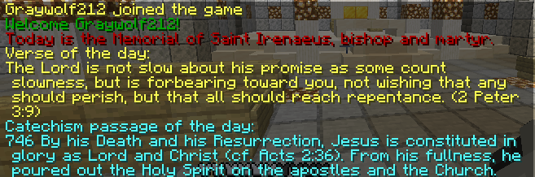

# CatholicMOTD

This plugin gives each player a Catholic message-of-the-day on login, with the goal of encouraging spiritual reflection and exposing the beauty of Catholic tradition.

## Current Features
Liturgical season information complete with corresponding colors (for instance, purple during Lent and Advent)
Information about current memorials, feast days, and solemnities
Bible verse of the day
Random Catechism passage of the day

## Commands
/catholic or /motd: Displays the full MOTD again.
/calendar: Displays the information about the liturgical day / season.
/verse: Displays the daily Bible verse.
/catechism: Displays the daily Catechism passage.
Installation
Just put the .jar file into your server's plugins folder and restart your server.

## Configuration
Below are the options you can configure with a description on how to use them:

- motd_template: This defines the order that the MOTD elements will be displayed in.
  - Macros are used to tell the template where to insert information from the plugin, and are surrounded by '%' characters (i.e. %verse%). These are all of the macros available: 
    - %greeting% : greeting message for the player, changes in some liturgical seasons (i.e. Merry Christmas player!)
    - %player% : the player's name, can be used to make a custom greeting
    - %calendar% : info about the liturgical calendar, memorials, etc
    - %verse% : the Bible verse of the day
    - %catechism% : the Catechism passage of the day
    - %seasonColor% : will color any text after it with the color of the liturgical season (green, purple, or white) 
  - You can use or not use any macros you want. For any non-catholic Christians, this means that you can just show the Bible verse if you would like!
  - You can use any chat color / text decoration symbols (The ones with the § symbol).
  - You can also add any text or decoration characters that you want.
- rejoin_template: The rejoin template is exactly the same as the motd_template, but is shown to players who have already joined before the same day instead of the normal motd_template. By default, returning players will only receive a greeting, but you can make it the exact same as the motd_template if you want.
- verse / catechism_cmd_color: These define the color for the verse and catechism passage when shown by running their commands. You can use the %seasonColor% macro, chat color codes, and/or any text you want to prefix the verse/passage with.
- bible_version: the Bible version to use for the verse of the day. The verse of the day is sourced from biblegateway.com, and you can theoretically use any bible version on the site (find the version abbreviation in the parenthesis after the full name when selecting a bible version on the site).
  - Some good Catholic versions that I've tested and seem to work are:
    - Revised Standard Version, Catholic Edition (RSVCE), the default config option
    - New Revised Standard Version, Catholic Edition (NRSVCE), I believe this is the one Fr. Mike Schmitz is reading from for the Bible-in-a-year podcast.
    - New American Bible, Revised Edition (NABRE)
  - Also, the King James Version (KJV), New King James Version (NKJV), and English Standard Version (ESV) appear to be working.
- catechism_max_length: Some Catechism passages are REALLY long; this limits the max length  for the catechism passage that will be chosen. The downside is that Catechism passages that are longer will never be shown. I do not recommend setting it lower than 150 - right now, it is programmed to just keep requesting a random catechism passage until it gets a short enough one, and if you go too low it may be stuck doing that forever - I will fix this when I get a chance.

## Feedback / Planned Features
Here are some of the features I hope to add soon!

- --More supported Bible versions-- Done in version 1.3!
- Daily prayer
- Daily saint quote
- Configurable incentives for reading daily info
If you have any suggestions for features, I would be happy to consider them! Please leave a comment below

I hope you enjoy this plugin! Peace be with you! 🙏🏼
